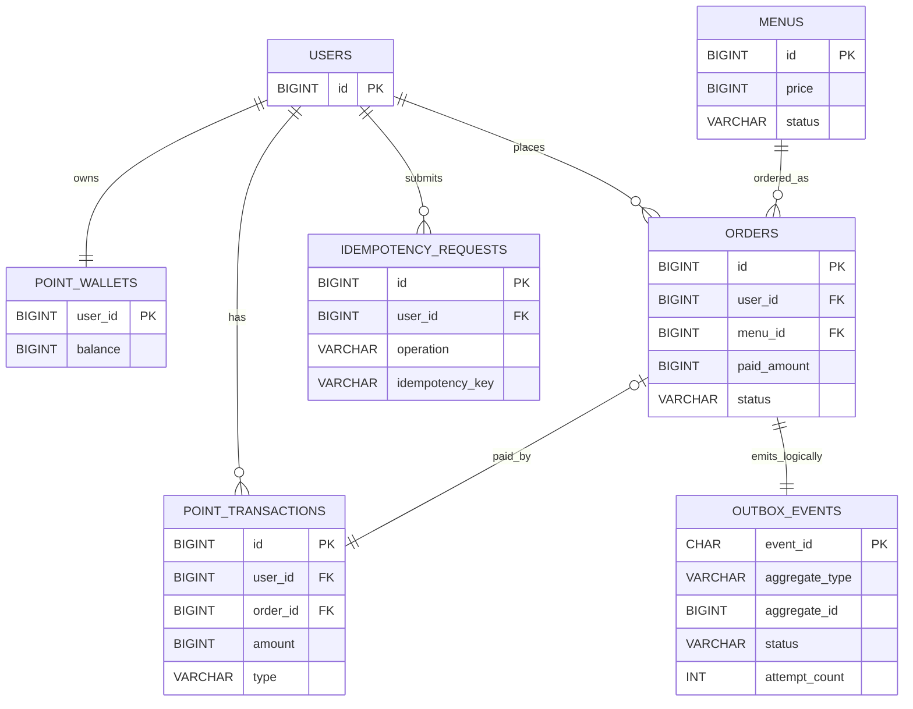

# Coffee Order System

다중 서버·다중 인스턴스 환경에서도 포인트와 주문의 정합성을 유지하는 커피 주문 시스템 프로젝트입니다.

## 현재 구현 상태

Phase 1의 MySQL 기반 네 API, DB 멱등성, 비관적 지갑 락, Transactional Outbox,
Mock HTTP 발행과 운영 관측성을 구현했습니다. 실제 `mysql:8.0.42`, HTTP stub, 다중 thread와
같은 DB를 공유하는 독립 Spring ApplicationContext 두 개로 핵심 수용 시나리오를 검증합니다.

Kafka 주문 이벤트 발행과 Redis 활성 메뉴 캐시는 **제출 이후의 향후 확장**이며 현재 런타임에는
의도적으로 포함하지 않습니다. 이번 과제의 데이터 플랫폼 전달 요구는 Mock HTTP와 Transactional
Outbox로 충족합니다. MySQL은 메뉴, 포인트, 주문, 멱등성, Outbox와 인기 순위의 유일한
정본입니다.

## 빠른 시작

### 준비 사항

- JDK 21
- IntelliJ IDEA
- Git
- Docker Desktop 또는 Testcontainers와 호환되는 Docker runtime

Gradle 8.14.5 Wrapper를 저장소에 포함하므로 Gradle은 별도로 설치하지 않아도 됩니다.

Docker daemon 가동 여부 확인, Git hook 설정, 코드 포맷, Windows PowerShell과 POSIX 셸 실행 및 검증 방법은 [Commands](./docs/COMMANDS.md)를 참고합니다.

로컬 실행과 통합 테스트는 실제 pull·기동을 확인한 `mysql:8.0.42` 이미지를 함께 사용합니다.

### 로컬 MySQL과 애플리케이션 실행

먼저 `docker version` 출력에 `Server` 섹션이 있는지 확인합니다. 아래 명령은 `compose.yml`로 `coffee-order-mysql` 컨테이너를 만들고 MySQL이 준비될 때까지 기다린 뒤 애플리케이션을 실행합니다. 기본 로컬 값으로 바로 실행할 수 있으며, 값을 바꿀 때만 [.env.example](./.env.example)을 `.env`로 복사해 수정합니다. `.env`는 커밋하지 않습니다.

Windows PowerShell:

```powershell
docker compose up -d --wait mysql
.\gradlew.bat bootRun
```

POSIX 셸(Linux, macOS, WSL):

```sh
docker compose up -d --wait mysql
./gradlew bootRun
```

다른 터미널에서 `http://localhost:8080/actuator/health`가 `UP`인지 확인합니다. 애플리케이션을 `Ctrl+C`로 종료한 뒤 MySQL 컨테이너도 제거합니다.

Windows PowerShell:

```powershell
Invoke-RestMethod http://localhost:8080/actuator/health
docker compose down
```

POSIX 셸(Linux, macOS, WSL):

```sh
curl --fail --silent --show-error http://localhost:8080/actuator/health
docker compose down
```

### IntelliJ에서 실행

1. IntelliJ에서 이 저장소의 루트 폴더를 엽니다.
2. Gradle 프로젝트 가져오기가 끝날 때까지 기다립니다.
3. Project SDK와 Gradle JVM이 JDK 21인지 확인합니다.
4. 터미널에서 `docker compose up -d --wait mysql`을 실행합니다.
5. `CoffeeOrderSystemApplication`의 `main` 메서드를 실행합니다.
6. 브라우저에서 [http://localhost:8080/actuator/health](http://localhost:8080/actuator/health)를 열어 `{"status":"UP"}`을 확인합니다.

Flyway가 빈 MySQL에 스키마와 초기 사용자·메뉴·0P 지갑을 만들고 Hibernate는 생성된 스키마를 `validate`만 합니다.

### Mock HTTP 이벤트 수신자

결제 주문이 커밋되면 애플리케이션은 `DATA_PLATFORM_BASE_URL`의
`POST /api/v1/order-events`로 `X-Event-Id`와 JSON 이벤트를 비동기 전송합니다. 수신자는
같은 `eventId`가 중복 도착할 수 있으므로 유니크 제약이나 동등한 멱등 처리를 적용해야 합니다.
수신자 장애는 이미 커밋된 주문 응답을 변경하지 않으며 Outbox가 최대 11회의 자동 전송 시도 후
실패 이벤트를 격리합니다. 변수별 기본값과 변경 방법은 [.env.example](./.env.example)을 따릅니다.

### 테스트와 전체 검증

Docker daemon이 실행 중인 상태에서 저장소의 JDK 21과 Gradle Wrapper 8.14.5로 다음 게이트를
실행합니다.

Windows PowerShell:

```powershell
.\gradlew.bat spotlessCheck
.\gradlew.bat test
.\gradlew.bat clean build
```

POSIX 셸(Linux, macOS, WSL):

```sh
./gradlew spotlessCheck
./gradlew test
./gradlew clean build
```

통합 테스트는 H2나 Repository mock 대신 Testcontainers MySQL을 사용합니다. Phase 1 수용
게이트는 동시 주문·충전, 교차 ApplicationContext 멱등성, Outbox HTTP 실패·재시도와
`INFORMATION_SCHEMA`, `ANALYZE TABLE`, `EXPLAIN FORMAT=JSON` 기반 주요 인덱스
`possible_keys`를 함께 검증합니다. 실제 애플리케이션 기동과 Health 확인을 포함한 전체 명령
정본은 [Commands](./docs/COMMANDS.md)를 따릅니다.

## 목표

- 커피 메뉴 목록 조회
- 포인트 충전
- 포인트 기반 주문·결제
- 결제 주문의 데이터 플랫폼 전달
- 직전 168시간 인기 메뉴 상위 3개 조회
- 동시성, 데이터 일관성, 다중 인스턴스, 예외와 테스트 고려

## 필수 API 요약

| 요구사항 | HTTP API | 입력 | 성공 결과 | 핵심 보장 |
| --- | --- | --- | --- | --- |
| 메뉴 목록 조회 | `GET /api/v1/menus` | 없음 | `ACTIVE` 메뉴를 ID 오름차순으로 반환 | 비활성 메뉴 제외 |
| 포인트 충전 | `POST /api/v1/users/{userId}/points/charges` | `Idempotency-Key`, `amount` | 충전 원장과 충전 뒤 잔액을 `201`로 반환 | 같은 요청은 한 번만 반영 |
| 주문·결제 | `POST /api/v1/orders` | `Idempotency-Key`, `userId`, `menuId` | `PAID` 주문과 남은 잔액을 `201`로 반환 | 주문·차감·원장·Outbox의 원자성 |
| 인기 메뉴 조회 | `GET /api/v1/menus/popular` | 없음 | 직전 168시간 상위 3개 메뉴 반환 | MySQL 주문 원본 기준의 정확한 횟수 |

각 요청·응답 필드, 대표 오류와 멱등성 헤더 계약은 [API 명세](./docs/API.md)를 따른다.

## 핵심 ERD



주문은 결제 시점의 메뉴·가격 스냅샷을 보존하고, Outbox는 `(aggregate_type, aggregate_id)`로
주문과 논리적으로 연결한다. 전체 컬럼·제약·인덱스와 상태 전이는 [ERD](./docs/ERD.md)를 따른다.

## 문제 해결 전략

### 포인트와 주문 정합성

여러 애플리케이션 인스턴스가 공유하는 MySQL을 정합성의 기준으로 사용합니다. 같은 사용자의 충전과 주문은 `point_wallets` 행을 `SELECT ... FOR UPDATE`로 잠그고, 잔액 변경·원장·주문·Outbox를 짧은 트랜잭션 안에서 처리합니다.

### 중복 요청

충전과 주문 API에 `Idempotency-Key`를 필수로 적용합니다. `(userId, operation, key)` DB 유니크 제약과 요청 해시, 최초 완료 응답 스냅샷을 사용해 재시도가 중복 충전·결제를 만들지 않게 합니다.

### 외부 데이터 전달

외부 API를 주문 트랜잭션 안에서 호출하지 않습니다. 주문과 `ORDER_PAID` Outbox 이벤트를 함께 커밋한 뒤 별도 작업자가 중복 가능한 at-least-once 방식으로 발행합니다. 이번 제출에서는 Mock HTTP 수신자를 사용하며, Kafka 전환은 향후 확장 방향입니다.

### 인기 메뉴 정확성

인기 메뉴는 Redis나 Kafka의 비동기 카운터가 아니라 MySQL의 `PAID` 주문 원본을 직접 집계합니다. 기준은 한 번 고정한 UTC 시각의 `[to - 168시간, to)`이며, 주문 횟수 내림차순과 메뉴 ID 오름차순으로 최대 3개를 선택합니다.

### 향후 확장: Redis 메뉴 캐시

Redis는 핵심 기능을 완성한 뒤 활성 메뉴 목록에만 Cache-Aside로 적용합니다. Redis는 정본이 아니며 장애 시 MySQL로 폴백합니다.

### 검증

H2 대신 MySQL Testcontainers로 비관적 락, 유니크 제약, 트랜잭션 롤백, `SKIP LOCKED`와 lease 회수를 검증합니다. 빠른 도메인 단위 테스트와 실제 DB 통합·동시성 테스트를 분리합니다.

### 요구사항별 검증 근거

| 요구사항·보장 | 검증 내용 | 대표 테스트 |
| --- | --- | --- |
| 메뉴 목록 | `ACTIVE` 메뉴만 ID 순으로 반환하고 빈 목록도 `200` | [MenuApiIntegrationTest](./src/test/java/com/coffeeorder/domain/menu/controller/MenuApiIntegrationTest.java) |
| 포인트 충전 | 멱등 재요청, 잔액·원장 일치, 오버플로 처리 | [PointChargeApiIntegrationTest](./src/test/java/com/coffeeorder/domain/point/controller/PointChargeApiIntegrationTest.java) |
| 주문·결제 | 주문·차감 원장·Outbox가 함께 커밋 또는 롤백 | [OrderApiIntegrationTest](./src/test/java/com/coffeeorder/domain/order/controller/OrderApiIntegrationTest.java) |
| 인기 메뉴 | 7일 경계, 동률, 활성 메뉴 조건을 정확히 집계 | [PopularMenuApiIntegrationTest](./src/test/java/com/coffeeorder/domain/ranking/controller/PopularMenuApiIntegrationTest.java) |
| 다중 인스턴스·동시성 | 20건 동시 주문, 독립 ApplicationContext 간 같은 키 경쟁, MySQL 지갑 락 | [PhaseOneAcceptanceIntegrationTest](./src/test/java/com/coffeeorder/acceptance/PhaseOneAcceptanceIntegrationTest.java), [PointWalletLockConcurrencyTest](./src/test/java/com/coffeeorder/domain/point/service/PointWalletLockConcurrencyTest.java) |
| 외부 전송 | HTTP 실패·재시도·lease 회수와 최대 시도 횟수 | [OutboxProductionCycleIntegrationTest](./src/test/java/com/coffeeorder/infra/outbox/OutboxProductionCycleIntegrationTest.java) |

다중 인스턴스 보장은 같은 MySQL을 공유하는 독립 Spring ApplicationContext 두 개를 사용해 DB 경계에서 검증합니다. 별도 OS 프로세스나 Kubernetes 배포 E2E는 과제 제출 이후의 운영 확장 범위입니다.

## 문서

| 문서 | 역할 |
| --- | --- |
| [PRD](./docs/PRD.md) | 제품 목표, 범위, 비즈니스 규칙, 수용 기준 |
| [Architecture](./docs/ARCHITECTURE.md) | 시스템 구조, 트랜잭션, 동시성, 장애와 테스트 전략 |
| [Phase 계획](./docs/phases/README.md) | 정본 계약을 Phase와 PR step 단위로 나눈 실행 계획 |
| [Conventions](./docs/CONVENTIONS.md) | 패키지 의존 방향, 계층별 책임, 구현·테스트 규칙 |
| [Commands](./docs/COMMANDS.md) | Git hook, 포맷, 실행, 테스트와 전체 검증 명령 |
| [ERD](./docs/ERD.md) | 테이블, 관계, 제약, 인덱스와 상태 전이 |
| [API](./docs/API.md) | HTTP·이벤트 요청/응답과 오류 계약 |
| [ADR](./docs/adr/README.md) | 대안과 기술적 선택 이유 |

## 주요 기술 선택

| 영역 | 선택 | 이유 |
| --- | --- | --- |
| 런타임 | Java 21, Spring Boot 3.5.16 | 과제 구현과 테스트 생태계 |
| 빌드 | Gradle Wrapper 8.14.5 | 별도 Gradle 설치 없는 재현 가능한 빌드 |
| 영속성 | JPA, MySQL 8.x | 트랜잭션·행 락·제약을 공유하는 정본 |
| 마이그레이션 | Flyway | 스키마와 초기 사용자·메뉴 재현 |
| 동시성 | MySQL 비관적 락 | 동일 사용자 포인트 쓰기 직렬화 |
| 중복 방지 | DB 기반 멱등성 | 다중 인스턴스와 재시작에도 효과 유지 |
| 외부 전달 | Transactional Outbox | 주문 커밋과 내구성 있는 이벤트 기록의 원자성 |
| 테스트 | JUnit 5, Testcontainers | 실제 MySQL 동작 검증 |
| 향후 확장 | Kafka, Redis | 이벤트 전달 채널과 메뉴 조회 캐시 |

상세한 대안과 트레이드오프는 [ADR 인덱스](./docs/adr/README.md)에 기록했습니다.
