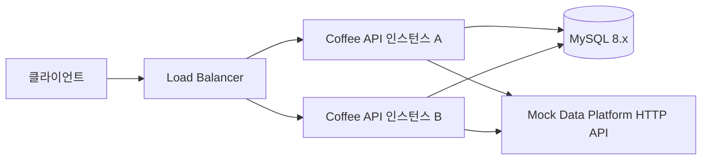
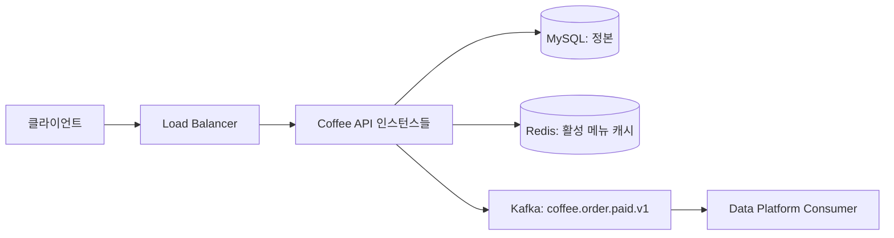
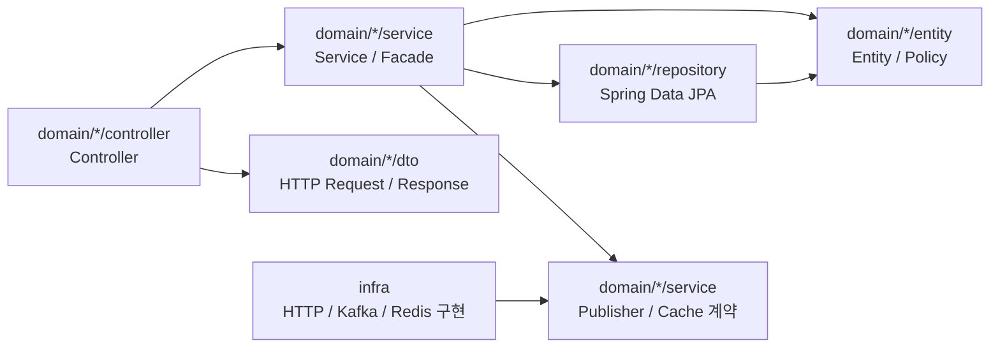
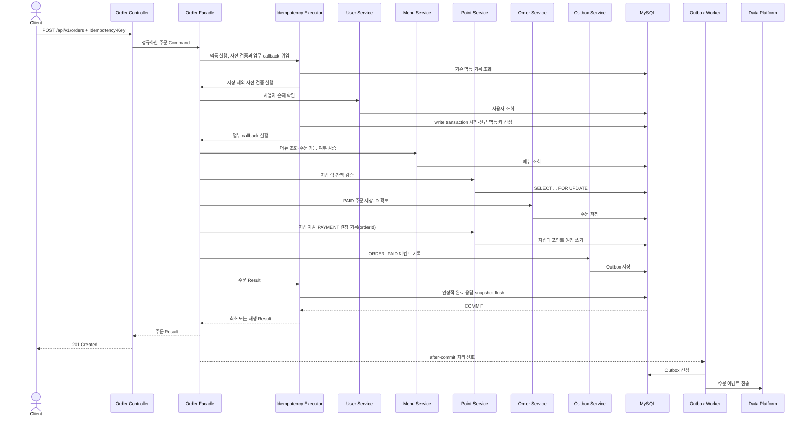

# 커피 주문 시스템 아키텍처

- 문서 상태: 설계 확정
- 작성일: 2026-07-10
- 관련 문서: [PRD](./PRD.md), [ERD](./ERD.md), [API 명세](./API.md), [ADR 목록](./adr/README.md)

## 1. 설계 목표

이 시스템은 하나의 Spring Boot 애플리케이션을 여러 인스턴스로 실행하는 환경을 전제로 한다. 모든 인스턴스는 같은 MySQL, 이후 같은 Redis와 Kafka를 사용한다. 정합성의 기준은 MySQL이며, 프로세스 메모리·로컬 락·Redis 캐시가 포인트 또는 주문의 최종 상태를 결정하지 않는다.

설계 우선순위는 다음과 같다.

1. 포인트와 주문의 정확성
2. 중복 요청에 대한 멱등성
3. 외부 시스템 장애로부터 주문 경로 격리
4. 다중 인스턴스에서 동일한 동작
5. 과제 범위에서 구현·테스트·설명 가능한 단순성
6. Kafka와 Redis로 확장할 수 있는 교체 가능한 경계

## 2. 시스템 컨텍스트

### 2.1 Phase 1



Phase 1에서는 MySQL이 메뉴, 포인트, 주문, 멱등성, Outbox의 정본이다. 각 인스턴스의 Outbox 작업자는 같은 테이블에서 처리할 이벤트를 짧게 선점한다.

### 2.2 Phase 2



Kafka는 Mock HTTP 발행 어댑터를 대체한다. Redis는 활성 메뉴 목록만 캐시한다. Kafka나 Redis가 중단되어도 MySQL의 주문과 포인트 정합성은 유지된다.

## 3. 기술 기준

| 구분 | 선택 | 역할 |
| --- | --- | --- |
| 언어 | Java 21 | 애플리케이션 구현 |
| 프레임워크 | Spring Boot 3.5.16 | REST, 트랜잭션, 검증, 비동기 작업 |
| 빌드 | Gradle Wrapper 8.14.5 | 로컬과 CI의 빌드 도구 버전 고정 |
| 영속성 | Spring Data JPA + 필요한 명시적 SQL | 일반 CRUD와 비관적 락·집계 쿼리 |
| 데이터베이스 | MySQL 8.x | 모든 핵심 상태의 정본 |
| 마이그레이션 | Flyway | 스키마와 초기 사용자·메뉴 재현 |
| 이벤트 전달 Phase 1 | Mock HTTP Adapter | 과제의 데이터 플랫폼 전송 검증 |
| 이벤트 전달 Phase 2 | Kafka | Outbox 이벤트 전달 채널 |
| 캐시 Phase 2 | Redis | 활성 메뉴 목록 Cache-Aside |
| 테스트 | JUnit 5, Testcontainers, Awaitility, HTTP Stub | 단위·통합·동시성·비동기 검증 |

Spring Boot 3.5.16과 Gradle 8.14.5는 초기 설정에서 고정했다. MySQL Docker 이미지와 추가 라이브러리 패치 버전은 해당 구현을 시작할 때 고정한다.

## 4. 애플리케이션 구조

단일 배포 단위 안에서 기능 경계를 분리하는 모듈러 모놀리스를 사용한다.

```text
coffee-order-system
└─ src/main/java/com/coffeeorder/
   ├─ domain/
   │  ├─ order/         # 주문·결제 유스케이스
   │  │  ├─ controller/
   │  │  ├─ dto/
   │  │  ├─ entity/
   │  │  ├─ repository/
   │  │  └─ service/
   │  ├─ menu/          # 메뉴 조회와 캐시 경계
   │  ├─ point/         # 지갑, 충전, 포인트 원장
   │  ├─ ranking/       # 인기 메뉴 조회
   │  ├─ outbox/        # 이벤트 저장, 선점, 재시도
   │  └─ idempotency/   # 쓰기 요청 중복 방지
   ├─ infra/            # HTTP, Kafka, Redis 외부 연동 구현
   └─ global/           # 설정, 오류 모델, 시간, 관측성
```

`domain`은 순수 도메인 계층만 뜻하지 않고 업무 기능을 모으는 최상위 네임스페이스다. 각 기능은 필요한 하위 패키지만 만들며 다음 의존 방향을 따른다.



- Controller는 입력 검증과 HTTP 변환만 담당한다.
- 단일 기능의 상태 변경은 Service가 유스케이스와 원자성 범위를 조정한다.
- 여러 기능을 가로지르는 흐름은 유스케이스를 소유한 기능의 Facade가 Service를 조합한다. Facade는 Repository를 직접 주입하지 않는다.
- 멱등 쓰기에서는 Service나 Facade 자체를 외부 `@Transactional`로 감싸지 않는다. Service나 Facade는 원자적 업무 콜백과 락 순서를 정의하고, `IdempotencyExecutor`가 별도 proxied runner 또는 `TransactionTemplate`로 물리 write transaction의 시작·commit을 실행한다.
- `IdempotencyExecutor`는 commit 또는 flush에서 발생한 유니크 충돌을 write transaction이 끝난 뒤 포착하고 새 read transaction에서 승자 결과를 재조회한다. 콜백 안의 하위 Service는 기본 `REQUIRED` 전파로 같은 write transaction에 참여하며 `REQUIRES_NEW`로 원자성을 나누지 않는다.
- Entity와 Service의 순수 정책은 잔액 검증, 충전, 차감과 같은 규칙을 표현한다.
- 외부 전송은 `OrderEventPublisher` 계약 뒤에 숨겨 HTTP 구현에서 Kafka 구현으로 교체한다.
- Redis는 `MenuCache` 계약 뒤에 숨기며 조회 실패 시 Repository로 폴백한다.

## 5. 정합성과 동시성 전략

### 5.1 불변 조건

아래 조건은 애플리케이션 검증과 DB 제약으로 함께 보호한다.

- `point_wallets.balance >= 0`
- 하나의 성공한 충전 요청은 충전 원장 1건만 만든다.
- 하나의 성공한 주문은 `PAID` 주문, `PAYMENT` 원장, `ORDER_PAID` Outbox를 각각 1건 만든다.
- 결제 원장의 `order_id`는 유일하다.
- 같은 `(user_id, operation, idempotency_key)`의 완료 기록은 하나뿐이다.
- 주문의 `paid_amount`는 메뉴의 결제 시점 가격과 같다.

MySQL `DATETIME(6)`과 애플리케이션 시각의 정밀도를 맞추기 위해 DB에 저장하거나 DB 조건으로 비교할 모든 `Instant`는 UTC `Clock`에서 캡처한 뒤 마이크로초 정밀도로 정규화한다. 주문 `paid_at`과 이벤트 `occurredAt`, 인기 조회의 `from`·`to`, Outbox의 `next_attempt_at`·`locked_until`·`published_at`에 같은 규칙을 적용하며, lease와 retry 시각은 계산 결과를 다시 마이크로초 정밀도로 정규화한다.

### 5.2 포인트 비관적 락

포인트 충전과 주문·결제는 `point_wallets.user_id` 기본 키로 지갑을 조회하면서 `SELECT ... FOR UPDATE`를 사용한다. 락은 트랜잭션 종료까지 유지한다.

```text
입력·사용자 검증 → 멱등성 확인/선점 → 메뉴 검증 → 지갑 행 비관적 락
        → 잔액 검증 → PAID 주문 저장·ID 확보 → 지갑 차감·PAYMENT(orderId) 원장
        → Outbox 저장 → 멱등 완료 응답 저장 → 커밋
```

모든 포인트 변경 흐름은 같은 순서로 잠금을 획득한다. 사용자 한 명의 요청은 직렬화되지만 서로 다른 사용자의 지갑 행은 독립적으로 처리할 수 있다. 외부 네트워크 호출은 이 트랜잭션 안에서 수행하지 않는다.

비관적 락을 선택한 근거와 트레이드오프는 [ADR-002](./adr/002-pessimistic-point-lock.md)에 기록한다.

### 5.3 멱등성 처리

멱등성 범위는 `(userId, operation, Idempotency-Key)`이다. `operation`은 `POINT_CHARGE` 또는 `ORDER_CREATE`이다.

1. Path와 body를 정규화해 SHA-256 `request_hash`를 만든다.
2. 이미 완료된 키가 있으면 해시를 비교한다.
3. 해시가 같으면 성공은 저장한 최초 완료 HTTP 상태와 본문을 그대로 반환하고, 결정적 오류는 최초 상태와 안정적인 오류 payload에 현재 요청의 `timestamp`·`traceId`를 조립해 반환한다.
4. 해시가 다르면 `409 IDEMPOTENCY_KEY_REUSED`를 반환한다.
5. 기록이 없으면 사용자 존재를 확인한 뒤 도메인 처리 트랜잭션에서 멱등성 행을 생성한다.
6. 동시 요청으로 유니크 제약이 충돌하면 현재 트랜잭션을 끝낸 뒤 새 읽기 트랜잭션에서 승자의 기록을 조회해 2~4단계를 적용한다.

저장 대상과 저장 제외 응답, 보존 기간, 새 키 계약은 [API 공통 규칙](./API.md#02-쓰기-요청-멱등성)을 정본으로 따른다. 결정적 비즈니스 실패는 도메인 변경 없이 오류 응답만 `COMPLETED`로 커밋한다.

`COMPLETED` 응답 snapshot은 같은 재요청에서 변하지 않는 비즈니스 payload만 저장한다. 주문의 결제 시각처럼 최초 업무 결과에 속하는 값은 포함하지만 오류 envelope의 요청별 `traceId`나 오류 발생 시각처럼 호출마다 달라지는 메타데이터는 저장하지 않는다.

중복 처리 로직은 트랜잭션 프록시 경계를 분리한다. 완료 기록이 없으면 `IdempotencyExecutor`가 사용자 존재 확인처럼 저장하지 않는 사전 검증 callback을 write transaction 밖에서 먼저 실행한다. 검증을 통과하면 별도 proxied runner 또는 `TransactionTemplate`로 `PROCESSING`, 도메인 쓰기와 `COMPLETED` snapshot flush를 한 transaction에서 실행·commit한다. 완료 snapshot flush가 실패하면 도메인 쓰기와 `PROCESSING` 행도 함께 롤백한다. 유니크 제약 예외로 rollback-only가 된 transaction 안에서 재조회하지 않고, runner가 종료된 뒤 새 read transaction을 사용한다.

## 6. 주문·결제 트랜잭션

Controller는 `OrderFacade`만 호출한다. `OrderFacade`는 유스케이스의 원자성 범위와 락 순서를 정의하지만 자체를 외부 `@Transactional`로 감싸지 않고, 저장 제외 사전 검증과 원자적 업무 callback을 `IdempotencyExecutor`에 위임한다. `IdempotencyExecutor`가 사전 검증과 물리 write transaction, commit·유니크 충돌 후 새 read transaction 재조회 경계를 담당한다. 업무 callback 안의 각 Service는 기본 `REQUIRED`로 참여해 자기 Repository만 사용하며 Facade는 Repository나 DB에 직접 접근하지 않는다.



메뉴 없음·비활성 또는 잔액 부족처럼 저장 대상인 결정적 실패에서는 주문 관련 쓰기를 하지 않고 오류 상태와 본문을 멱등 행에 저장한 뒤 정상 커밋한다. 예외를 던져 트랜잭션 전체를 rollback-only로 만들지 않는다.

실패 지점별 결과는 다음과 같다.

| 실패 | 결과 |
| --- | --- |
| 사용자 없음 | 트랜잭션 효과와 멱등 기록 없음 |
| 메뉴 없음·비활성 | 주문·원장·Outbox 없이 완료 오류 멱등 기록만 커밋 |
| 잔액 부족 | 주문·원장·Outbox 없이 `409` 멱등 기록만 커밋 |
| 주문 또는 Outbox 저장 실패 | 포인트 차감을 포함해 전체 롤백 |
| 응답 전송 직전에 서버 종료 | 트랜잭션은 커밋될 수 있으며 클라이언트는 같은 키로 결과 재조회 |
| 외부 데이터 플랫폼 실패 | 주문은 유지되고 Outbox만 재시도 |

## 7. 외부 이벤트 전달

### 7.1 Transactional Outbox

주문 이벤트를 외부 플랫폼에 직접 보내지 않고 주문 트랜잭션에서 `outbox_events`에 함께 저장한다. 이로써 주문만 커밋되고 내구성 있는 이벤트 기록은 남지 않는 유실 구간을 제거한다. 외부 전달 실패 자체는 없애지 않으며, 실패를 추적·재시도 가능한 Outbox 상태로 전환한다.

이벤트 예시는 다음과 같다.

```json
{
  "schemaVersion": 1,
  "eventId": "7e8422d3-9638-4e40-a230-efbea89d8d4a",
  "eventType": "ORDER_PAID",
  "occurredAt": "2026-07-10T04:30:00.123Z",
  "orderId": 1001,
  "userId": 10,
  "menuId": 3,
  "paymentAmount": 4500
}
```

Phase 1은 Mock HTTP API로 이 JSON을 전송한다. Phase 2는 동일한 논리 이벤트를 `coffee.order.paid.v1` Kafka 토픽에 `orderId` 키로 발행한다.

`occurredAt`은 주문 트랜잭션에서 `orders.paid_at`과 같은 UTC `Instant`로 고정하며 발행·재시도 시각으로 다시 계산하지 않는다. Phase 2에서 Kafka 토픽은 데이터 플랫폼의 공식 ingestion 경계다. broker ack를 플랫폼 수락으로 간주해 Outbox를 `PUBLISHED`로 바꾼다. 토픽 이후 소비·재시도·DLQ와 업무 반영은 데이터 플랫폼의 책임이며, 이 서비스는 downstream 소비 완료까지 추적하지 않는다.

### 7.2 다중 작업자 선점

네트워크 호출 중 DB 락을 유지하지 않도록 선점과 발행을 분리한다.

1. 짧은 트랜잭션에서 `attempt_count < 11`이면서 `next_attempt_at <= now`인 `PENDING` 행 또는 `locked_until < now`인 `PROCESSING` 행을 `FOR UPDATE SKIP LOCKED`로 조회한다.
2. lease가 만료된 `PROCESSING` 중 `attempt_count = 11`인 행은 재선점하거나 외부 호출하지 않고 짧은 트랜잭션에서 `FAILED`로 전이해 claim·lease를 비운다.
3. 선점할 행은 `PROCESSING`으로 바꾸고 `attempt_count`를 증가시키며 매 선점마다 새 UUID `claim_token`, `locked_by`, `locked_until` lease를 기록한 뒤 커밋한다.
4. DB 트랜잭션 밖에서 외부 전송을 수행한다.
5. 결과 갱신은 새 트랜잭션에서 `event_id`, `status = PROCESSING`, 자신이 받은 `claim_token`을 모두 조건으로 수행한다.
6. 성공하면 `PUBLISHED`와 `published_at`을 기록하고 claim·lease를 비운다. 재시도 가능한 실패는 아직 한도가 남았을 때만 `PENDING`으로 예약하고, `attempt_count = 11`이거나 영구 실패이면 `FAILED`로 바꾼다.
7. 조건부 UPDATE 결과가 0이면 lease를 잃은 작업자의 늦은 결과이므로 무시한다. 만료 행은 이미 다른 작업자가 새 `claim_token`으로 회수했을 수 있다.

커밋 직후 로컬 after-commit 신호로 첫 처리를 깨우고, 1초 주기의 DB 스캔을 유실 방지 장치로 둔다. 정상 상태에서 첫 전송 시도 목표는 커밋 후 1초 이내다.

### 7.3 재시도와 중복

- 한 자동 처리 주기에서 최초 dispatch 1회 이후 최대 10회 다시 선점하여 최대 11회다. 정상 경로의 실제 외부 호출도 주기당 최대 11회다.
- 네트워크 오류, 타임아웃, `429`, `5xx`는 지수 백오프와 jitter로 재시도한다. 재시도 번호를 `n = 1..10`이라 할 때 지연은 `min(2^(n-1)초 × U(0.8, 1.2), 300초)`다.
- 스키마 오류와 같은 재시도 불가능한 `4xx`는 즉시 `FAILED`로 격리한다.
- 발행 성공 후 `PUBLISHED` 기록 전에 프로세스가 종료되면 같은 이벤트가 다시 전송될 수 있다.
- 선점 커밋 후 외부 호출 전에 프로세스가 종료되면 `attempt_count` 한 회가 소비될 수 있다. `attempt_count < 11`이면 lease 만료 후 재선점하고, `attempt_count = 11`이면 추가 선점 없이 `FAILED`로 격리한다. 한도에 도달한 이벤트는 삭제하지 않고 수동 재처리한다.
- 수신자는 `eventId`를 멱등 키로 사용해야 한다.
- `FAILED` 행은 삭제하지 않는다. 운영 확인 후 [ERD의 수동 재처리 절차](./ERD.md#41-outbox)대로 원자적으로 초기화해 새 재시도 주기를 시작한다.

따라서 보장은 “성공 시까지 내구성 있게 최소 1회 처리하며, 자동 재시도 한도 후에는 유실시키지 않고 격리·수동 재처리한다”이다. 정확히 한 번 전달을 주장하지 않는다.

## 8. 인기 메뉴 집계

주문 Facade는 주입받은 UTC `Clock`의 한 `Instant`를 마이크로초 정밀도로 정규화한 뒤 `paid_at`과 이벤트 `occurredAt`에 함께 사용한다. 조회 Service도 같은 종류의 UTC `Clock`에서 `asOf`를 한 번 캡처해 마이크로초 정밀도로 정규화하고 `from = asOf - 168시간`을 계산한다. 운영 인스턴스의 시스템 시계는 NTP로 동기화하고, 테스트에서는 고정 `Clock`을 주입한다. 각 요청은 캡처한 하나의 시각만 사용한다.

```sql
SELECT
    o.menu_id,
    COUNT(*) AS order_count
FROM orders o
JOIN menus m ON m.id = o.menu_id
WHERE o.status = 'PAID'
  AND m.status = 'ACTIVE'
  AND o.paid_at >= :asOfMinus168Hours
  AND o.paid_at < :asOf
GROUP BY o.menu_id
ORDER BY order_count DESC, o.menu_id ASC
LIMIT 3;
```

- 기간: `[asOf - 168시간, asOf)`
- 시간대: DB UTC, API RFC 3339 UTC
- 순위 기준: `COUNT(*) DESC`, `menu_id ASC`
- 메뉴가 3개 미만이면 존재하는 항목만 반환
- 메뉴 정보는 현재 `ACTIVE` 메뉴에서 반환하고, 주문 횟수는 주문 원본에서 계산

`orders(status, paid_at, menu_id)` 복합 인덱스로 상태·기간 필터를 지원한다. 데이터 규모가 커져 집계 비용이 문제가 되기 전에는 정확성과 단순성을 우선한다. 이후 일별 집계 테이블을 도입하려면 별도 ADR에서 원본 대사와 지연 허용 범위를 먼저 결정한다.

## 9. Redis 메뉴 캐시

Redis는 Phase 2에서 활성 메뉴 목록에만 Cache-Aside로 적용한다.

```text
GET menus:active:v1
  ├─ hit  → 역직렬화 후 반환
  └─ miss → MySQL 조회 → TTL과 함께 Redis 저장 → 반환
```

- 캐시 키: `menus:active:v1`
- 초기 TTL: 5분에 작은 랜덤 jitter 추가
- Redis timeout 또는 장애: 오류를 외부에 노출하지 않고 MySQL로 폴백
- MySQL 조회 결과가 비어 있어도 짧게 캐시하여 반복 미스를 방지
- 향후 메뉴 관리 API를 추가하면 커밋 후 캐시 삭제 정책을 함께 추가
- 포인트 잔액, 멱등성, 인기 순위는 Redis에 정본으로 저장하지 않음

## 10. 다중 인스턴스와 장애 대응

| 대상 | 다중 인스턴스 보장 | 장애 시 동작 |
| --- | --- | --- |
| 포인트 변경 | 공유 MySQL 행 락 | DB 장애 시 쓰기 실패, 부분 커밋 없음 |
| 중복 요청 | MySQL 유니크 제약 | 동일 키의 승자 1건만 커밋 |
| Outbox 처리 | `SKIP LOCKED` + lease | 한도가 남은 lease 만료 행은 다른 작업자가 회수하고, `attempt_count = 11`이면 추가 호출 없이 `FAILED`로 격리 |
| 메뉴 캐시 | 공유 Redis, DB 정본 | Redis 장애 시 MySQL 폴백 |
| 인기 집계 | MySQL 주문 원본 | 캐시 지연과 무관하게 정확한 원본 조회 |
| Kafka 발행 | Outbox가 미발행 이벤트 보존 | 브로커 복구 후 재시도 |

애플리케이션 인스턴스는 상태를 로컬 디스크에 보관하지 않는다. 롤링 배포와 인스턴스 종료 시 새 요청 수락을 중단하되, 처리 중 트랜잭션은 graceful shutdown 시간 안에 끝내도록 한다.

## 11. 관측성과 운영

### 11.1 로그

- 모든 요청에 `traceId`를 부여한다.
- 로그에 `userId`, `orderId`, `eventId`, `operation`, 결과 코드를 구조화해서 남긴다.
- 전체 요청 본문, 멱등 응답 본문, 포인트 잔액은 불필요하게 로그에 남기지 않는다.
- 외부 전송 오류는 HTTP 상태, 예외 유형, 시도 횟수만 제한된 길이로 저장한다.

### 11.2 메트릭

- API 요청 수·지연·오류율
- 포인트 지갑 락 대기 시간과 lock timeout 수
- 멱등 재생 수와 키 충돌 수
- Outbox `PENDING`, `PROCESSING`, `FAILED` 개수와 최고 대기 시간
- 이벤트 첫 전송 지연과 재시도 횟수
- Redis hit ratio, timeout, DB fallback 수
- 인기 집계 쿼리 지연

### 11.3 알림 후보

- `FAILED` Outbox가 1건 이상 발생
- 가장 오래된 `PENDING` 이벤트가 정상 목표를 초과
- DB lock timeout 또는 deadlock 급증
- Redis 장애로 DB fallback이 지속 증가

## 12. 테스트 전략

### 12.1 단위 테스트

- 충전액 양수 검증과 `BIGINT` 오버플로 방지
- 충분·부족 잔액의 포인트 차감
- 주문 가격 스냅샷 생성
- 멱등 요청 해시 비교
- 저장 대상인 결정적 실패와 저장하지 않는 일시적 실패 분류
- Outbox 재시도 간격이 정의된 jitter 범위와 300초 cap 안에 있는지, `FAILED`로 전환되는지 검증
- 인기 기간 계산과 동률 정렬

### 12.2 MySQL Testcontainers 통합 테스트

- Flyway가 빈 MySQL에서 성공하고 초기 데이터가 생성되는지 검증
- 실제 `SELECT ... FOR UPDATE`가 같은 지갑 요청을 직렬화하는지 검증
- 잔액 10,000P에 1,000P 주문 20건을 병렬 실행해 성공 10건·실패 10건·잔액 0P 검증
- 같은 충전 요청을 같은 멱등 키로 병렬 실행해 충전 효과가 1건인지 검증
- 같은 주문 요청을 같은 멱등 키로 병렬 실행해 주문·차감·Outbox 효과가 각각 1건인지 검증
- 서로 다른 키의 충전과 주문을 같은 지갑에 병렬 실행해 lost update 없이 최종 잔액이 정확한지 검증
- 충전과 주문에 같은 키 문자열을 사용해도 `operation` 범위가 달라 서로 충돌하지 않는지 검증
- 주문·원장·Outbox 중 하나의 저장 실패가 전체 롤백되는지 검증
- 충전과 주문 각각에서 `COMPLETED` snapshot flush 실패가 도메인 쓰기와 `PROCESSING` 행을 모두 롤백하고, 같은 키 재시도는 효과를 정확히 한 번만 만드는지 검증
- `paid_at`의 하한 포함·상한 제외와 `PAID`·`ACTIVE` 필터 검증
- Outbox 작업자 여러 개가 한 행을 동시에 정상 발행하지 않는지 검증
- `attempt_count < 11`인 lease 만료 행이 회수되고, `attempt_count = 11`인 행은 추가 호출 없이 `FAILED`가 되는지 검증
- 나노초가 포함된 고정 `Clock`도 주문·이벤트·조회 경계와 lease·retry 시각에서 MySQL `DATETIME(6)` 정밀도로 일관되게 정규화되는지 검증

동시성 테스트의 공통 실행 규칙은 [Conventions의 테스트 섹션](./CONVENTIONS.md#테스트)을 따른다.

### 12.3 외부 연동 테스트

- HTTP Stub으로 성공, timeout, `429`, `4xx`, `5xx`를 재현
- Awaitility로 비동기 상태가 `PUBLISHED`, 재시도 `PENDING`, 최종 `FAILED`가 되는지 검증
- 같은 `eventId`가 중복 전달될 수 있음을 검증
- Mock 수신자는 `eventId` 유니크 제약으로 같은 이벤트를 한 번만 반영하는지 검증
- 실제 발행 JSON이 `schemaVersion`, `eventId`, 사용자·메뉴 ID, 결제 금액 계약을 지키는지 검증
- Phase 2에서 Kafka·Redis도 Testcontainers로 교체 가능한 어댑터 계약을 검증

Testcontainers 선택 근거는 [ADR-007](./adr/007-mysql-testcontainers.md)에 기록한다.

## 13. 구현 순서

1. Spring Boot 프로젝트와 Flyway 스키마·초기 데이터 구성
2. 메뉴 조회와 공통 오류 계약
3. 포인트 지갑·원장과 비관적 락 충전
4. 멱등성 실행기와 중복 충전 테스트
5. 주문·결제 단일 트랜잭션
6. Outbox 발행기와 Mock HTTP 전송
7. 인기 메뉴 집계와 경계 테스트
8. 다중 스레드 통합 테스트와 관측성
9. Kafka 발행 어댑터
10. Redis 메뉴 캐시와 장애 폴백

각 단계는 기능과 테스트가 함께 통과한 시점에 커밋하고 바로 원격 저장소에 push한다.

## 14. 관련 ADR

| ADR | 결정 |
| --- | --- |
| [ADR-001](./adr/001-modular-monolith-shared-mysql.md) | 모듈러 모놀리스와 공유 MySQL 정본 |
| [ADR-002](./adr/002-pessimistic-point-lock.md) | 포인트 지갑 비관적 락 |
| [ADR-008](./adr/008-idempotent-error-response-metadata.md) | 쓰기 API 멱등성과 요청별 오류 메타데이터 |
| [ADR-004](./adr/004-transactional-outbox.md) | Transactional Outbox와 전달 보장 |
| [ADR-005](./adr/005-database-popular-ranking.md) | MySQL 주문 원본 인기 집계 |
| [ADR-006](./adr/006-redis-menu-cache.md) | Redis 활성 메뉴 Cache-Aside와 정본 경계 |
| [ADR-007](./adr/007-mysql-testcontainers.md) | 실제 MySQL 기반 통합 테스트 |
