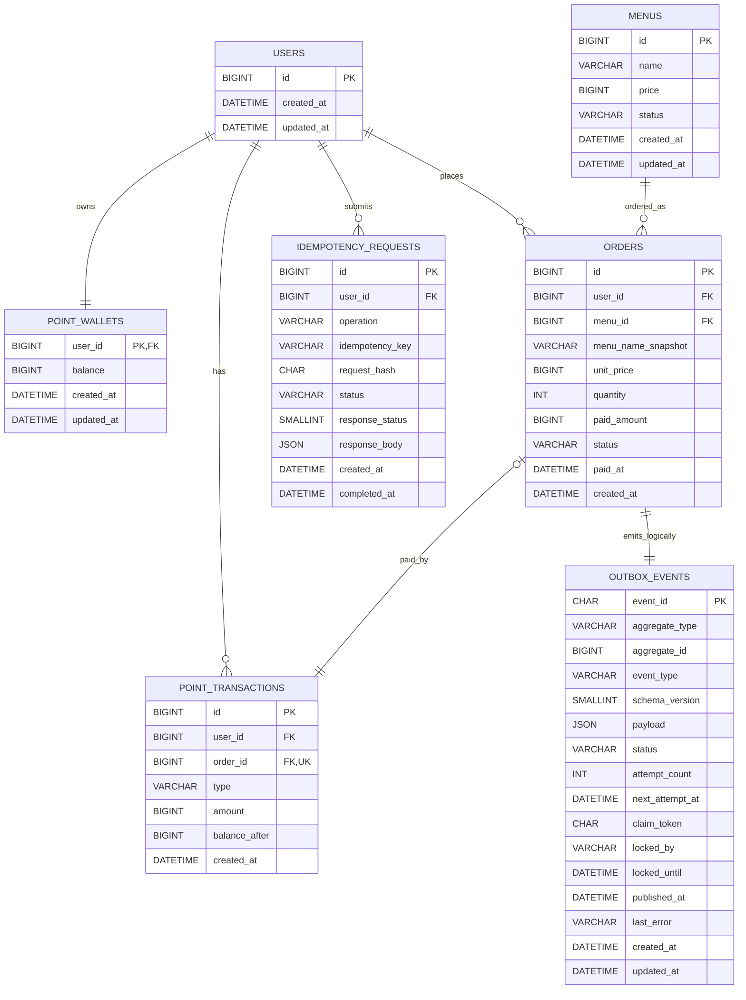
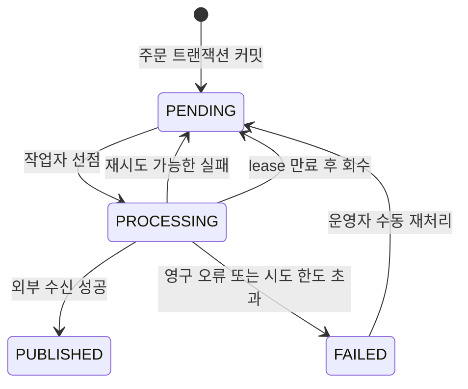
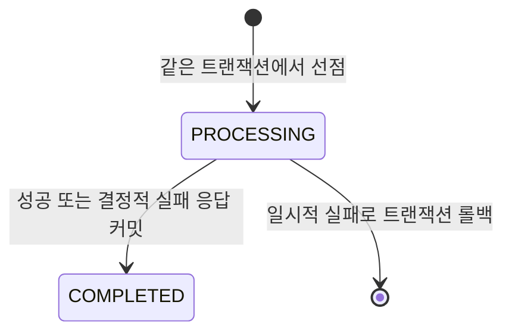

# 커피 주문 시스템 ERD

- 문서 상태: 설계 확정
- 작성일: 2026-07-10
- 데이터베이스: MySQL 8.x
- 관련 문서: [PRD](./PRD.md), [아키텍처](./ARCHITECTURE.md), [API 명세](./API.md)

## 1. 모델링 원칙

- MySQL을 사용자, 메뉴, 포인트, 주문, 멱등성, Outbox의 정본으로 사용한다.
- 포인트와 가격은 소수점 없는 signed `BIGINT`로 저장한다.
- 모든 시각은 UTC `DATETIME(6)`으로 저장하고 JDBC 세션 타임존도 UTC로 고정한다.
- 주문에는 결제 시점의 메뉴 이름, 단가, 결제 금액을 스냅샷으로 보존한다.
- 포인트 지갑은 현재 잔액을, 포인트 원장은 변경 이력을 담당한다.
- 원장은 수정하지 않는 append-only 데이터다.
- Redis 캐시와 Kafka 토픽은 재생성 가능한 외부 인프라이므로 관계형 ERD에 포함하지 않는다.

## 2. 관계도

`ORDERS`와 `OUTBOX_EVENTS`의 관계는 `(aggregate_type = 'ORDER', aggregate_id = orders.id)`인 논리 관계다. Outbox를 다른 aggregate에도 재사용할 수 있도록 물리 FK는 두지 않는다.

## 3. 테이블 명세

### 3.1 `users`

사전에 등록된 사용자의 최소 식별 정보다. 인증과 회원 프로필은 V1 범위가 아니다.

| 컬럼 | 타입 | NULL | 제약 및 설명 |
| --- | --- | --- | --- |
| `id` | `BIGINT` | N | PK, 사용자 식별값 |
| `created_at` | `DATETIME(6)` | N | 생성 시각 UTC |
| `updated_at` | `DATETIME(6)` | N | 수정 시각 UTC |

알 수 없는 사용자 ID는 자동 생성하지 않고 `404 USER_NOT_FOUND`로 처리한다.

### 3.2 `menus`

| 컬럼 | 타입 | NULL | 제약 및 설명 |
| --- | --- | --- | --- |
| `id` | `BIGINT` | N | PK |
| `name` | `VARCHAR(100)` | N | 표시 이름 |
| `price` | `BIGINT` | N | 현재 가격, `CHECK (price > 0)` |
| `status` | `VARCHAR(20)` | N | `ACTIVE`, `INACTIVE` |
| `created_at` | `DATETIME(6)` | N | 생성 시각 UTC |
| `updated_at` | `DATETIME(6)` | N | 수정 시각 UTC |

인덱스:

- `idx_menus_status_id (status, id)` — 활성 메뉴의 ID 오름차순 조회
- `CHECK (status IN ('ACTIVE', 'INACTIVE'))`

메뉴는 주문과 연결되므로 hard delete하지 않고 상태를 변경한다. V1에는 메뉴 관리 API가 없으며 Flyway로 초기화한다.

### 3.3 `point_wallets`

사용자별 현재 포인트 잔액을 저장하며 비관적 락의 대상이다.

| 컬럼 | 타입 | NULL | 제약 및 설명 |
| --- | --- | --- | --- |
| `user_id` | `BIGINT` | N | PK, FK → `users.id` |
| `balance` | `BIGINT` | N | 기본값 `0`, `CHECK (balance >= 0)` |
| `created_at` | `DATETIME(6)` | N | 생성 시각 UTC |
| `updated_at` | `DATETIME(6)` | N | 마지막 잔액 변경 시각 UTC |

사용자마다 지갑 행이 반드시 1개 존재하도록 사용자 초기 데이터와 지갑 초기 데이터를 같은 Flyway migration에서 준비한다. 존재하지 않는 행에는 `SELECT ... FOR UPDATE` 락을 걸 수 없으므로 지갑을 주문 시 지연 생성하지 않는다.

### 3.4 `point_transactions`

포인트 변경 이력을 보존하는 불변 원장이다.

| 컬럼 | 타입 | NULL | 제약 및 설명 |
| --- | --- | --- | --- |
| `id` | `BIGINT` | N | PK, auto increment |
| `user_id` | `BIGINT` | N | FK → `users.id` |
| `order_id` | `BIGINT` | Y | FK → `orders.id`, 결제 원장만 사용 |
| `type` | `VARCHAR(20)` | N | `CHARGE`, `PAYMENT` |
| `amount` | `BIGINT` | N | 방향과 무관한 양수, `CHECK (amount > 0)` |
| `balance_after` | `BIGINT` | N | 변경 직후 잔액, `CHECK (balance_after >= 0)` |
| `created_at` | `DATETIME(6)` | N | 변경 시각 UTC |

제약과 인덱스:

- `uk_point_transactions_order_id (order_id)` — MySQL은 여러 `NULL`을 허용하므로 주문별 결제 원장만 1건으로 제한한다.
- `idx_point_transactions_user_created (user_id, created_at, id)` — 사용자 원장 추적용이다.
- `CHECK ((type = 'CHARGE' AND order_id IS NULL) OR (type = 'PAYMENT' AND order_id IS NOT NULL))`

`CHARGE`는 잔액을 더하고 `PAYMENT`는 잔액을 뺀다. `amount` 자체에 음수를 사용하지 않아 부호 해석 오류를 줄인다.

### 3.5 `orders`

| 컬럼 | 타입 | NULL | 제약 및 설명 |
| --- | --- | --- | --- |
| `id` | `BIGINT` | N | PK, auto increment |
| `user_id` | `BIGINT` | N | FK → `users.id` |
| `menu_id` | `BIGINT` | N | FK → `menus.id` |
| `menu_name_snapshot` | `VARCHAR(100)` | N | 결제 시점 메뉴 이름 |
| `unit_price` | `BIGINT` | N | 결제 시점 단가, `CHECK (unit_price > 0)` |
| `quantity` | `INT` | N | V1 고정값 `1` |
| `paid_amount` | `BIGINT` | N | V1에서는 `unit_price`와 같음 |
| `status` | `VARCHAR(20)` | N | V1 성공 상태 `PAID` |
| `paid_at` | `DATETIME(6)` | N | 주문 트랜잭션의 주입 UTC `Clock`에서 고정한 결제 시각 |
| `created_at` | `DATETIME(6)` | N | 생성 시각 UTC |

제약과 인덱스:

- `CHECK (quantity = 1)`
- `CHECK (paid_amount = unit_price * quantity)`
- `CHECK (status = 'PAID')` — V1 상태 계약. 취소·환불 추가 시 migration과 ADR로 확장한다.
- `idx_orders_popular (status, paid_at, menu_id)` — 인기 메뉴 기간·상태 필터
- `idx_orders_user_paid (user_id, paid_at, id)` — 사용자 주문 추적용

메뉴 이름과 가격이 나중에 바뀌어도 과거 결제 사실은 변하지 않는다. 인기 메뉴 응답의 메뉴 이름과 가격은 주문 스냅샷이 아니라 현재 `ACTIVE` 메뉴의 값이며, `orderCount`만 주문 원본에서 계산한다.

### 3.6 `idempotency_requests`

충전과 주문 쓰기 요청의 최초 완료 응답을 보존한다.

| 컬럼 | 타입 | NULL | 제약 및 설명 |
| --- | --- | --- | --- |
| `id` | `BIGINT` | N | PK, auto increment |
| `user_id` | `BIGINT` | N | FK → `users.id` |
| `operation` | `VARCHAR(30)` | N | `POINT_CHARGE`, `ORDER_CREATE` |
| `idempotency_key` | `VARCHAR(128)` | N | 클라이언트가 생성한 키 |
| `request_hash` | `CHAR(64)` | N | 정규화 요청의 SHA-256 hex |
| `status` | `VARCHAR(20)` | N | 트랜잭션 내부 `PROCESSING`, 커밋 시 `COMPLETED` |
| `response_status` | `SMALLINT` | Y | 최초 완료 HTTP 상태 |
| `response_body` | `JSON` | Y | 최초 완료 응답 스냅샷 |
| `created_at` | `DATETIME(6)` | N | 처리 시작 시각 UTC |
| `completed_at` | `DATETIME(6)` | Y | 최초 멱등 응답 확정 시각 UTC |

제약과 인덱스:

- `uk_idempotency_scope (user_id, operation, idempotency_key)`
- `CHECK (operation IN ('POINT_CHARGE', 'ORDER_CREATE'))`
- `CHECK (status IN ('PROCESSING', 'COMPLETED'))`

`PROCESSING` 행은 사용자 존재 확인 뒤 도메인 처리 트랜잭션 안에서 생성되므로 다른 트랜잭션에는 커밋 전까지 보이지 않는다. `201` 성공과 결정적 비즈니스 실패는 `COMPLETED`와 응답 스냅샷을 커밋한다. 구조 검증 실패, 사용자 없음, DB·락·서버의 일시적 실패는 행을 만들지 않거나 롤백한다. V1에서는 자동 만료·삭제하지 않는다.

### 3.7 `outbox_events`

| 컬럼 | 타입 | NULL | 제약 및 설명 |
| --- | --- | --- | --- |
| `event_id` | `CHAR(36)` | N | PK, UUID, 수신 측 멱등 키 |
| `aggregate_type` | `VARCHAR(30)` | N | V1 `ORDER` |
| `aggregate_id` | `BIGINT` | N | V1 주문 ID |
| `event_type` | `VARCHAR(50)` | N | V1 `ORDER_PAID` |
| `schema_version` | `SMALLINT` | N | V1 `1` |
| `payload` | `JSON` | N | 전송할 불변 이벤트 스냅샷. `occurredAt = orders.paid_at` |
| `status` | `VARCHAR(20)` | N | `PENDING`, `PROCESSING`, `PUBLISHED`, `FAILED` |
| `attempt_count` | `INT` | N | Outbox dispatch 선점 횟수, 기본값 `0` |
| `next_attempt_at` | `DATETIME(6)` | N | 다음 선점 가능 시각 |
| `claim_token` | `CHAR(36)` | Y | 매 선점마다 새로 발급하는 UUID |
| `locked_by` | `VARCHAR(100)` | Y | 관측용 처리 인스턴스·워커 ID |
| `locked_until` | `DATETIME(6)` | Y | lease 만료 시각 |
| `published_at` | `DATETIME(6)` | Y | 성공 시각 UTC |
| `last_error` | `VARCHAR(1000)` | Y | 제한된 길이의 마지막 오류 |
| `created_at` | `DATETIME(6)` | N | 주문과 함께 생성된 시각 |
| `updated_at` | `DATETIME(6)` | N | 마지막 상태 변경 시각 |

제약과 인덱스:

- `uk_outbox_aggregate_event (aggregate_type, aggregate_id, event_type)` — 주문별 `ORDER_PAID` 이벤트 1건
- `idx_outbox_pending (status, next_attempt_at, created_at)` — `PENDING` 선점 후보 조회
- `idx_outbox_expired_lease (status, locked_until, created_at)` — 만료된 `PROCESSING` 회수
- `idx_outbox_aggregate (aggregate_type, aggregate_id)` — 주문 이벤트 추적
- `CHECK (status IN ('PENDING', 'PROCESSING', 'PUBLISHED', 'FAILED'))`
- `CHECK (aggregate_type = 'ORDER' AND event_type = 'ORDER_PAID')` — V1 이벤트 계약
- `CHECK (attempt_count BETWEEN 0 AND 11)` — 최초 1회와 최대 10회 재시도

작업자는 짧은 트랜잭션에서 이벤트를 `PROCESSING`으로 바꾸고 새 `claim_token`과 lease를 남긴 뒤 외부 호출은 트랜잭션 밖에서 수행한다. `locked_until`이 지난 `PROCESSING` 행은 새 token으로 회수할 수 있다. 결과 UPDATE는 `event_id`, `status = PROCESSING`, 현재 `claim_token`이 모두 일치할 때만 허용하여 lease를 잃은 작업자의 늦은 결과가 새 상태를 덮어쓰지 못하게 한다.

## 4. 상태 전이

### 4.1 Outbox

`attempt_count`는 작업자가 이벤트를 `PROCESSING`으로 선점할 때 증가한다. 값 `1`이 최초 dispatch이고 `2~11`이 최대 10회의 재선점이다. 선점 커밋 후 실제 외부 호출 전에 작업자가 종료되면 횟수 한 회가 소비될 수 있으나, lease 만료 후 다음 주기로 복구하고 최종 격리된 이벤트는 수동 재처리한다. 따라서 정상 경로의 실제 외부 호출은 최대 11회이며 이보다 많아지지 않는다.

`FAILED` 이벤트를 수동 재처리할 때는 원인을 기록한 뒤 하나의 트랜잭션에서 `attempt_count = 0`, `next_attempt_at = 현재 UTC`, `claim_token = NULL`, `locked_by = NULL`, `locked_until = NULL`, `status = PENDING`으로 초기화한다. 기존 실패 이력은 구조화 로그와 감사 기록으로 보존한다.

### 4.2 멱등성

## 5. 트랜잭션별 쓰기 집합

| 유스케이스 | 잠금 | 생성·변경 데이터 | 영속화·일시 오류 시 |
| --- | --- | --- | --- |
| 포인트 충전 | `point_wallets` 사용자 행 `FOR UPDATE` | 지갑 증가, `CHARGE` 원장, 성공 멱등 응답 | 모두 롤백 |
| 주문·결제 | `point_wallets` 사용자 행 `FOR UPDATE` | 지갑 감소, `PAID` 주문, `PAYMENT` 원장, Outbox, 성공 멱등 응답 | 모두 롤백 |
| 결정적 비즈니스 실패 | 필요한 경우 사용자 지갑 행 | 완료 오류 멱등 응답만 저장, 도메인 쓰기 없음 | 응답 저장 실패 시 멱등 행도 롤백 |
| Outbox 선점 | 후보 Outbox 행 `FOR UPDATE SKIP LOCKED` | `PROCESSING`, lease, dispatch 선점 횟수 | 선점 롤백, 다른 작업자가 처리 가능 |
| Outbox 결과 | event ID + claim token 대상 행 | `PUBLISHED`, `PENDING` 또는 `FAILED` | stale token이면 갱신하지 않고 lease 만료 후 복구 |

## 6. 삭제와 보존

- 사용자, 메뉴, 주문, 포인트 원장은 FK 무결성을 위해 hard delete하지 않는다.
- 메뉴는 `INACTIVE` 상태로 주문 가능 여부를 제어한다.
- 포인트 원장은 append-only로 유지한다.
- Outbox `PUBLISHED`·`FAILED` 정리 주기는 운영 데이터가 쌓인 뒤 별도 ADR로 결정한다.
- 멱등 완료 기록은 V1에서 만료시키지 않는다. 보존 기간을 추가할 때는 클라이언트 키 재사용 계약을 함께 변경한다.

## 7. Flyway 초기화

첫 migration은 위 테이블, 제약, 인덱스를 생성한다. 별도 seed migration은 과제 실행용 사용자와 메뉴를 만들고 각 사용자에 `balance = 0`인 지갑을 함께 생성한다.

MySQL 8의 `CHECK` 제약이 실제로 적용되는 버전을 고정하고, Testcontainers 통합 테스트에서 다음을 검증한다.

- 음수 잔액과 0 이하 가격·원장 금액이 DB에서도 거절되는가?
- 주문별 결제 원장과 주문별 Outbox 이벤트가 중복 생성되지 않는가?
- 멱등성 복합 유니크 제약이 다중 트랜잭션 경쟁에서도 한 건만 허용하는가?
- 인기 집계와 Outbox polling 쿼리가 예상 인덱스를 사용하는가?
